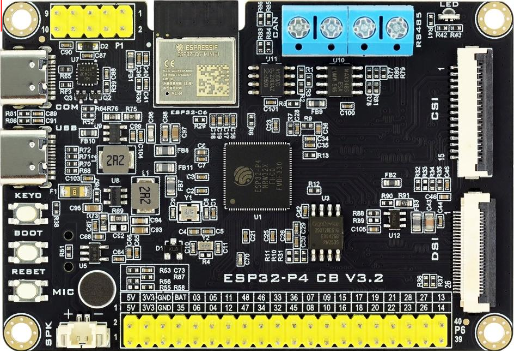
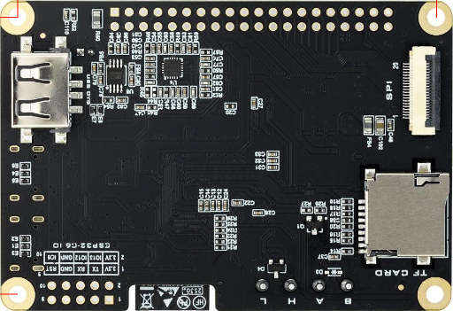
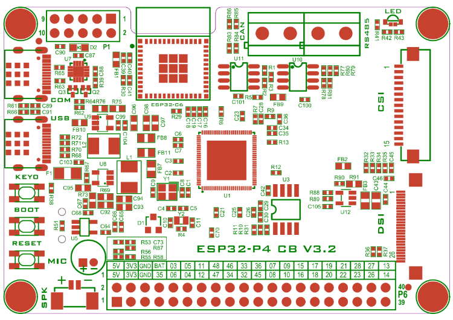
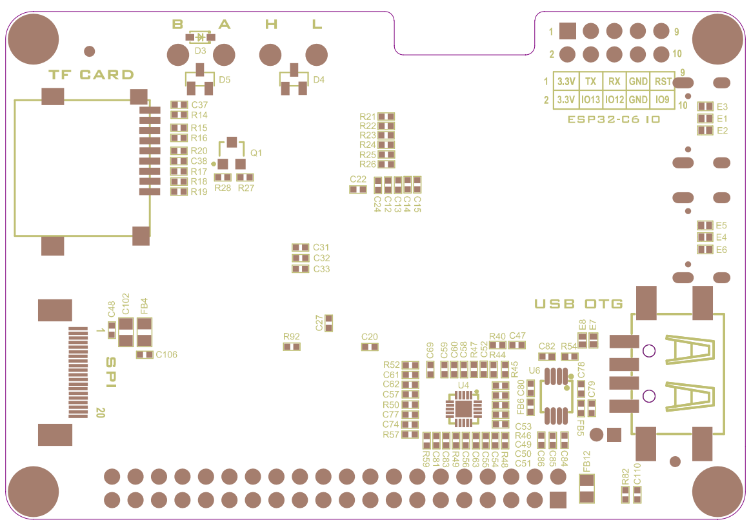
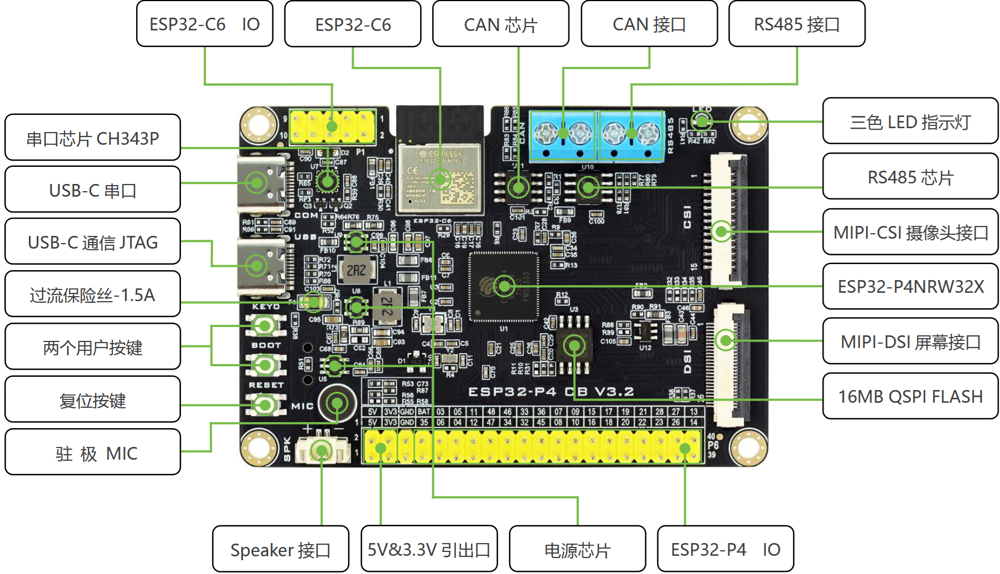

# ESP32-P4 CB V3.2 (`p4-cb-v3_2/`)

Core board ("CB") V3.2 around the **ESP32-P4NRW32X**: dual-core RISC-V @ up to
**400 MHz**, **32 MB** on-package PSRAM, **16 MB** QSPI flash (GD25Q128),
40 MHz crystal. Carrier-side peripherals: ESP32-C6 co-module (WiFi 6 / BLE 5,
SDIO-slaved to the P4), CH343P USB-UART bridge, USB-OTG + USB-JTAG, MIPI-DSI
and SPI display interfaces, MIPI-CSI camera interface, ES8311 audio codec +
NS4150B PA, TP8485E-SR RS485, TJA1050 CAN, TF card slot, MEMS mic + speaker
connector, tricolor user LED.

Applications live under [`app/`](app/) (one folder per project):

| Project | Path | Indicator | Notes |
|---------|------|-----------|-------|
| `blink_hello` | `app/blink_hello/` | LED0 (GPIO 14, green) + LED1 (GPIO 13, blue) | Alternating blink, prints CPU frequency (400 MHz) + internal die temperature every second |
| `dhry_400m` | `app/dhry_400m/` | (none) | Dhrystone: **1,395,673 D/s = 1.986 DMIPS/MHz** @ 400 MHz (10M runs) |
| `coremark_400m` | `app/coremark_400m/` | (none) | CoreMark: **1258.8 it/s = 3.15/MHz** @ 400 MHz (`crcfinal 0x25b5`) |
| `ov5647_lcd_preview` | `app/ov5647_lcd_preview/` | (none) | OV5647 MIPI-CSI camera live preview on the 3.5" WKS35HV035-WCT MIPI-DSI display (esp_video + ISP + PPA) |
| `wifi_con_test` | `app/wifi_con_test/` | LED0 (GPIO 14, green) | WiFi scan + connect test via the C6 co-module (esp_hosted/SDIO) |
| `board_server` | `app/board_server/` | (heartbeat) | e_server-style web demo: page + `/api/leds` (2 LEDs) + `/api/adc` (die temp) + OV5647 MJPEG `/stream` with simultaneous LCD preview + `/api/info` |
| `touch_rec_play` | `app/touch_rec_play/` | (none) | Touch UI on the 3.5" display: 10 s mic record (PSRAM) + playback through the ES8311/NS4150B, progress bar state machine |

The frontend's **host simulator** lives at [`e_server/`](e_server/) (board
root, not an app): serve the identical page/API from a PC with
`python build_web.py && make && ./e_server 8080`. It is also the source of
truth for the frontend — regenerate the firmware's `web_assets.h` with
`python e_server/build_web.py --out app/board_server/main/web_assets.h`.

Both benchmarks use the `nano-f411` GCC flag recipe
(`-Ofast -ffp-contract=fast` + `-funroll-loops` for Dhrystone /
`-funroll-all-loops` for CoreMark); measured results in their READMEs.

## Board images

Front / back 3D views, layout and feature callouts:









Feature callouts (board_4): CH343P serial chip + USB-C serial port, USB-C
JTAG, 1.5 A fuse, two user buttons (KEY0 = GPIO 48, BOOT = GPIO 35), reset
button, MEMS mic, speaker connector, ESP32-C6 module + its IO header, CAN
transceiver (TJA1050) + CAN terminal, RS485 transceiver (TP8485E-SR) + RS485
terminal, tricolor LED, MIPI-CSI camera interface, MIPI-DSI display
interface, 16 MB QSPI flash, power chips (TLV62569 buck + LDOs), ESP32-P4 IO
header, 5 V & 3.3 V breakouts.

Vendor hardware documents (schematic `ESP32-P4 CB V3.2_SCH.pdf`, front/back
silkscreen drawings, user manual) live in the hardware repo
`D:\main-esp-db\main-esp32p4-cb-32\`.

## Key facts for firmware work

| Aspect | Value |
|--------|-------|
| SoC | ESP32-P4NRW32X, 2x RISC-V @ 400 MHz (`CONFIG_ESP_DEFAULT_CPU_FREQ_MHZ_400`) |
| Toolchain | `riscv32-esp-elf-` (P4 is RISC-V, **not** Xtensa) |
| Flash | 16 MB QSPI (GD25Q128), DIO @ 80 MHz |
| PSRAM | 32 MB on-package |
| Crystal | 40 MHz |
| Console | UART0, GPIO 37 (TX) / GPIO 38 (RX) via CH343P USB-C "COM" port |
| LEDs | LED0 = GPIO 14 (green), LED1 = GPIO 13 (blue) — tricolor LED, **low active** |
| Buttons | KEY0 = GPIO 48, BOOT = GPIO 35, RESET = CHIP_PU |
| Temperature | internal die sensor (`driver/temperature_sensor.h`) |

## ESP32-P4 connections (105 pins)

| 引脚序号 | 引脚名称 | 引脚功能定义 | 连接关系说明 |
|---------|---------|-------------|-------------|
| 1 | GPIO1 | XTAL_32K_P | 连接 32.768KHz 晶振 |
| 2 | GPIO2 | I2S_MCLK | 连接 ES8311 的 MCLK 脚 |
| 3 | GPIO3 | I2S_DSDIN | 连接 ES8311 的 DSDIN 脚 |
| 4 | GPIO4 | I2S_SCLK | 连接 ES8311 的 SCLK 脚 |
| 5 | GPIO5 | I2S_ASDOUT | 连接 ES8311 的 ASDOUT 脚 |
| 6 | GPIO6 | I2S_LRCK | 连接 ES8311 的 LRCK 脚 |
| 7 | GPIO7 | SPI2_CS | SPI 屏幕接口的 SPI_CS 脚 |
| 8 | GPIO8 | SPI2_MOSI | SPI 屏幕接口的 SPI_MOSI 脚 |
| 9 | VDD_LP | 电源输入 | 连接 3.3V 电源 |
| 10 | GPIO9 | SPI2_SCK | SPI 屏幕接口的 SPI_SCK 脚 |
| 11 | GPIO10 | SPI2_MISO | SPI 屏幕接口的 SPI_MISO 脚 |
| 12 | GPIO11 | PA_CTRL | 连接 NS4150B 的 CTRL 脚 |
| 13 | GPIO12 | C6_WKUP | 连接 ESP-C6 模组的 IO2 |
| 14 | GPIO13 | LED1 | 连接三色 LED 灯的蓝灯 |
| 15 | GPIO14 | LED0 | 连接三色 LED 灯的绿灯 |
| 16 | GPIO15 | CTP-INT_RTP-PEN | DSI、SPI 屏幕接口的触摸信号 |
| 17 | GPIO16 | CTP-SCL_RTP-SCK | DSI、SPI 屏幕接口的触摸信号 |
| 18 | GPIO17 | CTP-SDA_RTP-MOSI | DSI、SPI 屏幕接口的触摸信号 |
| 19 | GPIO18 | CTP-RST_RTP-CS | DSI、SPI 屏幕接口的触摸信号 |
| 20 | GPIO19 | C6_EN | 连接 ESP-C6 模组的 EN 脚 |
| 21 | VDD_IO_0 | 电源输入 | 连接 3.3V 电源 |
| 22 | GPIO20 | LCD_DC | SPI 屏幕接口的命令/数据选择 |
| 23 | GPIO21 | LCD_PWREN | DSI、SPI 屏幕接口的电源控制脚 |
| 24 | GPIO22 | LCD_RST | DSI、SPI 屏幕接口的复位引脚 |
| 25 | GPIO23 | BL_CTR | DSI、SPI 屏幕接口的背光控制脚 |
| 26 | VDD_HP_0 | 电源输入 | 连接 1.3V 电源 |
| 27 | FLASH_CS | 专用 | 连接 GD25Q128 的 CS 脚 |
| 28 | FLASH_Q | 专用 | 连接 GD25Q128 的 DO(IO1)脚 |
| 29 | FLASH_WP | 专用 | 连接 GD25Q128 的 WP(IO2)脚 |
| 30 | VDD_FLASHIO | 电源输入 | 连接 MCU 的 VDDO_FLASH 脚 |
| 31 | FLASH_HOLD | 专用 | 连接 GD25Q128 的 HOLD(IO3)脚 |
| 32 | FLASH_CK | 专用 | 连接 GD25Q128 的 CLK 脚 |
| 33 | FLASH_D | 专用 | 连接 GD25Q128 的 DI(IO0)脚 |
| 34 | DSI_REXT | 专用 | / |
| 35 | DSI_DATAP1 | 专用 | DSI 屏幕接口的 DSI_D1P 脚 |
| 36 | DSI_DATAN1 | 专用 | DSI 屏幕接口的 DSI_D1N 脚 |
| 37 | DSI_CLKN | 专用 | DSI 屏幕接口的 DSI_CKN 脚 |
| 38 | DSI_CLKP | 专用 | DSI 屏幕接口的 DSI_CKP 脚 |
| 39 | DSI_DATAP0 | 专用 | DSI 屏幕接口的 DSI_D0P 脚 |
| 40 | DSI_DATAN0 | 专用 | DSI 屏幕接口的 DSI_D0N 脚 |
| 41 | VDD_MIPI_DPHY | 电源输入 | 连接 MCU 的 VDDO_3 脚 |
| 42 | CSI_DATAN0 | 专用 | CSI 摄像头接口的 CSI_D0N 脚 |
| 43 | CSI_DATAP0 | 专用 | CSI 摄像头接口的 CSI_D0P 脚 |
| 44 | CSI_CLKP | 专用 | CSI 摄像头接口的 CSI_CLKP 脚 |
| 45 | CSI_CLKN | 专用 | CSI 摄像头接口的 CSI_CLKP 脚 |
| 46 | CSI_DATAN1 | 专用 | CSI 摄像头接口的 CSI_D1N 脚 |
| 47 | CSI_DATAP1 | 专用 | CSI 摄像头接口的 CSI_D1P 脚 |
| 48 | CSI_REXT | 专用 | / |
| 49 | USB_DM | 专用 | 连接 USB OTG 接口的 D-脚 |
| 50 | USB_DP | 专用 | 连接 USB OTG 接口的 D+脚 |
| 51 | VDD_USBPHY | 电源输入 | 连接 3.3V 电源 |
| 52 | GPIO24 | USB_D- | 连接 USB 通信接口的 DN 脚 |
| 53 | GPIO25 | USB_D+ | 连接 USB 通信接口的 DP 脚 |
| 54 | / | / | 连接 ESP_VDD_HP |
| 55 | GPIO26 | CSI_RST | CSI 摄像头接口的 IO0 脚 |
| 56 | GPIO27 | CSI_PWDN | CSI 摄像头接口的 IO1 脚 |
| 57 | GPIO28 | I2C_SDA | CSI 摄像头接口的 SDA 脚；ES8311 的 CDATA 脚 |
| 58 | GPIO29 | I2C_SCL | CSI 摄像头接口的 SCL 脚；ES8311 的 CCLK 脚 |
| 59 | VDD_PSRAM_0 | 电源输入 | 连接 MCU 的 VDDO_PSRAM 脚 |
| 60 | GPIO30 | RS485_RXD | 连接 TP8485E-SR 的 R 脚 |
| 61 | GPIO31 | RS485_TXD | 连接 TP8485E-SR 的 D 脚 |
| 62 | VDD_IO_4 | 电源输入 | 连接 3.3V 电源 |
| 63 | GPIO32 | RS485_RE | 连接 TP8485E-SR 的 RE、DE 脚 |
| 64 | GPIO33 | CAN_TXD | 连接 TJA1050 的 TXD 脚 |
| 65 | GPIO34 | CAN_RXD | 连接 TJA1050 的 RXD 脚 |
| 66 | GPIO35 | BOOT | 连接按键 BOOT |
| 67 | VDD_PSRAM_1 | 电源输入 | 连接 MCU 的 VDDO_PSRAM 脚 |
| 68 | GPIO36 | 启动模式控制 | 连接上拉电阻 10K |
| 69 | GPIO37 | U0_TXD | 连接 CH343P 的 RXD 脚 |
| 70 | GPIO38 | U0_RXD | 连接 CH343P 的 TXD 脚 |
| 71 | VDDO_FLASH | 电源输出 | 给 MCU 的 VDD_FLASHIO 脚及 W25Q128 供电 |
| 72 | VDDO_PSRAM | 电源输出 | 给 MCU 的 VDD_PSRAM_0 脚及 VDD_PSRAM_1 脚供电 |
| 73 | VDDO_3 | 电源输出 | 给 MCU 的 VDD_MIPI_DPHY 脚供电 |
| 74 | VDDO_4 | 电源输出 | 给 MCU 的 VDD_IO_5 脚供电 |
| 75 | VDD_LDO | 电源输入 | 连接 3.3V 电源 |
| 76 | VDD_HP_2 | 电源输入 | 连接 1.3V 电源 |
| 77 | VDD_DCDCC | 电源输入 | 连接 3.3V 电源 |
| 78 | FB_DCDC | 模拟 | 连接 TLV62569(U9)的 FB 脚 |
| 79 | EN_DCDC | 模拟 | 连接 TLV62569(U9)的 EN 脚 |
| 80 | GPIO39 | SD1_D0 | TF 卡接口的 DAT0 脚 |
| 81 | GPIO40 | SD1_D1 | TF 卡接口的 DAT1 脚 |
| 82 | GPIO41 | SD1_D2 | TF 卡接口的 DAT2 脚 |
| 83 | GPIO42 | SD1_D3 | TF 卡接口的 DAT3 脚 |
| 84 | GPIO43 | SD1_CLK | TF 卡接口的 CLK 脚 |
| 85 | VDD_IO_5 | 电源输入 | 连接 MCU 的 VDDO_4 脚 |
| 86 | GPIO44 | SD1_CMD | TF 卡接口的 CMD 脚 |
| 87 | GPIO45 | SD1_PWR_EN | 控制 TF 卡接口的 VDD |
| 88 | GPIO46 | LCD_ID | DSI 屏幕接口的 LCD_ID 脚 |
| 89 | GPIO47 | RTP_MISO | SPI 屏幕接口的触摸信号 |
| 90 | GPIO48 | KEY0 | 连接按键 KEY0 |
| 91 | VDD_HP_3 | 电源输入 | 连接 1.3V 电源 |
| 92 | GPIO49 | SD2_D0 | 连接 ESP-C6 模组的 IO20 |
| 93 | GPIO50 | SD2_D1 | 连接 ESP-C6 模组的 IO21 |
| 94 | GPIO51 | SD2_D2 | 连接 ESP-C6 模组的 IO22 |
| 95 | GPIO52 | SD2_D3 | 连接 ESP-C6 模组的 IO23 |
| 96 | VDD_IO_6 | 电源输入 | 连接 3.3V 电源 |
| 97 | GPIO53 | SD2_CMD | 连接 ESP-C6 模组的 IO18 |
| 98 | GPIO54 | SD2_CLK | 连接 ESP-C6 模组的 IO19 |
| 99 | XTAL_N | 模拟 | 连接 40MHz 晶振 |
| 100 | XTAL_P | 模拟 | 连接 40MHz 晶振 |
| 101 | VDD_ANA | 电源输入 | 连接 3.3V 电源 |
| 102 | VDD_BAT | 电源输入 | 连接 3.3V 电源 |
| 103 | CHIP_PU | ESP32_EN | 连接按键 RESET |
| 104 | GPIO0 | XTAL_32K_N | 连接 32.768KHz 晶振 |
| 105 | GND | 地 | 连接 GND |

> Note: row 104 is listed as "CPIO0" in the vendor table — it is GPIO0
> (XTAL_32K_N).

## Vendor examples referenced

Borrowed hardware knowledge from the vendor BSP examples in
`D:\main-esp-db\main-esp32p4-cb-32\vendor_ex\basic__routines\`:

| Example | What was taken |
|---------|----------------|
| `01_led` | LED0 = GPIO 14 / LED1 = GPIO 13, plain `gpio_config` output, low-active |
| `04_uart` | console UART0 on GPIO 37/38 through CH343P at 115200 (default IDF console, no extra init needed) |
| `14_tsens` | internal temperature sensor: `temperature_sensor_install()` + `temperature_sensor_enable()` + `temperature_sensor_get_celsius()` from `driver/temperature_sensor.h` |

The vendor examples target the same **ESP-IDF v6.0.2** as this repo.

## Building

```bash
cd p4-cb-v3_2\app\blink_hello
idf.py set-target esp32p4    # first time only (or just idf.py build)
idf.py build
idf.py -p COMxx flash monitor
```
